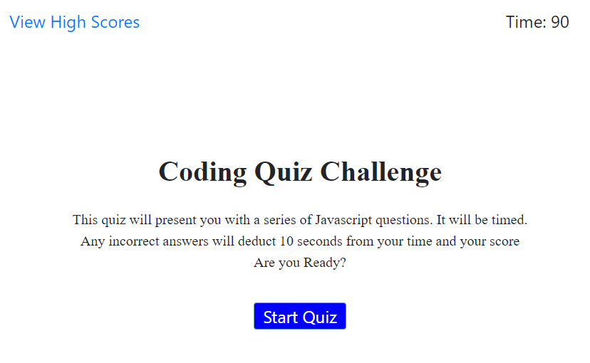
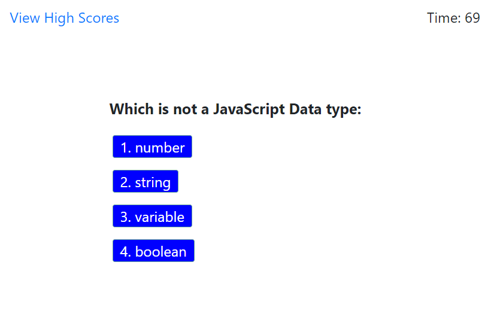
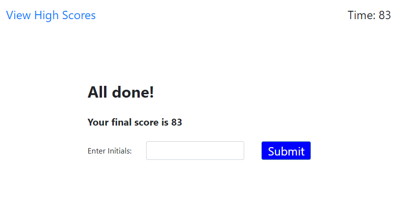
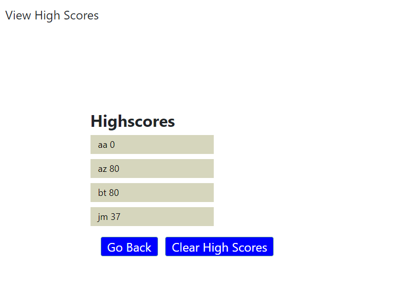

# Code Quiz

This is a quiz application built for people learning about Javascript. 

## Description

The application emphasizes the use of Javascript to provide quiz questions and collect inputs from the quiz taker to determine whether the answers are correct. When the quiz is complete, the app generates a score and appends a final page of results from the user data.

## Link to Site

https://codragon2020.github.io/code_quiz/index.html

This site was made with:

## Screenshots

